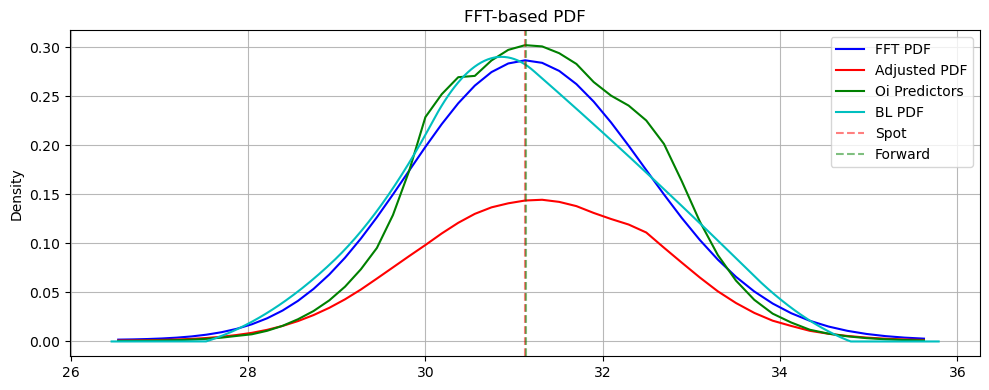

# Density

Risk-neutral and flow-aware implied probability density estimation from equity option chains. This project calibrates parametric (Heston) and non-parametric (Andreasen–Huge) models to option prices, extracts implied PDFs, and adjusts them using dealer positioning (gamma, vanna, charm, open interest) for a more market-aware distribution.



---

## Overview

- **Risk-neutral PDFs**: Heston model (Gil–Pelaez pricing, parallel differential evolution) and Andreasen–Huge arbitrage-free splines.
- **Flow-aware adjustment**: Reweight the base PDF using gamma (GEX), vanna (VEX), charm (CEX), and open-interest change so the distribution reflects dealer hedging and pinning/breakout risk.
- **Validation**: PDF quality scoring (integral, mode, skew/kurtosis, tails) and optional backtesting (see `backtesting.ipynb`).

---

## Methodology

A short summary; full detail is in **`docs/`**.

### 1. Base density

- **Heston** (`heston_calibrator.py`): Calibrate Heston (or Bates) parameters to market option prices via parallel differential evolution. Extract PDF via Gil–Pelaez (no damping) or Breeden–Litzenberger from fitted prices.
- **Andreasen–Huge** (`anderson_huge.py`): Arbitrage-free spline fit to call prices; PDF from second derivative with smoothness and convexity penalties.

### 2. Flow-aware PDF (dealer positioning)

Weights are applied using exposure and flow data at each strike (see **`docs/methodology.md`**):

| Exposure / flow | Role in PDF |
|----------------|-------------|
| **GEX (gamma)** | Mode shaping: positive → pinning, negative → breakout risk. |
| **VEX (vanna)** | Tail shaping: high vanna → fatter tails (vol–price feedback). |
| **CEX (charm)** | Short-dated tails and overnight decay. |
| **OI change** | Confidence: positive OI change reinforces weight; negative dampens. |

Interactions (e.g. gamma–vanna, gamma–charm) form a hedging-feedback view; the flow-adjusted PDF is “dealer-aware” (mode ≈ pinning, tails ≈ hedging risk). Implementation: `FlowAwarePDF` and `FlowData` in `heston_calibrator.py`; tuning and integration params are in **`docs/heston_calibrator_guide.md`**.

### 3. Pipeline

1. Load option chain (e.g. via `Manager` / `bin`).
2. Preprocess: filter OTM, pick expiry, aggregate by strike (`pipe.py`: `preprocess_option_chain`, `agg_by_strike`).
3. Calibrate Heston (or run Andreasen–Huge).
4. Extract base PDF (FFT or Breeden–Litzenberger).
5. Optionally adjust with flows: `FlowAwarePDF.adjust_pdf()` using GEX/VEX/CEX/OI change.
6. Validate with `validate.score_pdf_quality()` and/or backtests.

---

## Repository layout

```
density/
├── README.md                 # This file
├── heston_calibrator.py       # Heston/Bates calibration, Gil–Pelaez pricing, FlowAwarePDF
├── anderson_huge.py           # Andreasen–Huge spline fit and PDF
├── pipe.py                    # Option chain preprocessing (OTM, expiry, agg by strike)
├── validate.py                # PDF quality scoring
├── demo.ipynb                 # End-to-end demo (data → calibration → flow-adjusted PDF)
├── backtesting.ipynb          # Backtesting flow-aware / Heston PDFs
├── option_chain.csv           # Sample option chain data
├── test.py                    # Tests
└── docs/                      # Methodology and example outputs
    ├── methodology.md         # Flow-aware PDF: GEX/VEX/CEX/OI definitions and interactions
    ├── heston_calibrator_guide.md  # Heston calibrator usage, N/umax, flow adjustment, walls/magnet
    ├── more.md                # Extension ideas (hybrid density, backtest signals, etc.)
    ├── write_up.tex           # LaTeX write-up (can reference plots from docs/)
    └── example_plots/         # Save example figures here (e.g. from demo.ipynb)
```

**Example plots**: Save figures (e.g. base vs flow-adjusted PDF, IV fit, key strikes) under **`docs/example_plots/`** so the write-up and README can reference them.

---

## Quick start

1. **Environment**: Activate conda env `ds24` and use the project `.env` for DB/config (see parent `stockdir` rules).
2. **Data**: Option chain via `Manager` (e.g. `stock.options.chain_df`) or load `option_chain.csv` for a minimal run.
3. **Demo**: Run `demo.ipynb` (preprocess chain → calibrate Heston → extract PDF → flow-adjusted PDF; plots can be saved to `docs/example_plots/`).
4. **Backtest**: Run `backtesting.ipynb` for flow-aware vs base PDF evaluation.

Minimal calibration + flow-adjusted PDF (see **`docs/heston_calibrator_guide.md`** for full options):

```python
from density.pipe import preprocess_option_chain
from density.heston_calibrator import HestonCalibrator, FlowAwarePDF, FlowData

# Preprocess chain (OTM, front month, aggregate by strike)
gcdf = preprocess_option_chain(option_chain, expiry=0)
strikes = gcdf['strike'].values
prices = gcdf['lastprice'].values  # or mid
S0 = float(gcdf['stk_price'].iloc[-1])
tau = (gcdf['timevalue'].iloc[0] / 365.0)  # years
r = 0.05

# Calibrate and extract PDF
cal = HestonCalibrator(N=1024, umax=150)
result = cal.calibrate(strikes, prices, S0, tau, r, pop_size=30, max_iter=100)
strikes_pdf, pdf_base = cal.extract_pdf_fft(S0, result.params, tau, r)

# Flow-adjusted PDF
flows = FlowData(strikes=strikes, gex=gcdf['gexp'], vex=gcdf['vexp'], cex=gcdf['cexp'], oi_chg=gcdf['oi_chg'])
adj = FlowAwarePDF(alpha_gex=0.3, alpha_vex=0.2)
pdf_adj, _ = adj.adjust_pdf(strikes_pdf, pdf_base, S0, flows, tau)
```

---

## Documentation

- **`docs/methodology.md`** — Flow-aware PDF: definitions of GEX/VEX/CEX/OI change and how they interact (gamma–vanna, charm, OI).
- **`docs/heston_calibrator_guide.md`** — Heston calibrator: Gil–Pelaez vs damped Carr–Madan, integration parameters (N, umax), `FlowAwarePDF` usage, walls/magnet, Numba (experimental).
- **`docs/more.md`** — Ideas: hybrid market–Heston tails, physical vs RN comparison, backtest signals.
- **`docs/example_plots/`** — Place example figures here (e.g. PDF comparison, IV fit, key strikes).

---

## Dependencies

- NumPy, SciPy, pandas
- tqdm (progress), logging
- matplotlib for plotting (e.g. in notebooks)
- Optional: Numba (experimental in `heston_calibrator.py`; off by default)

Database and ticker data follow the parent `Stocks` project (Manager, `.env`, `data/`).
